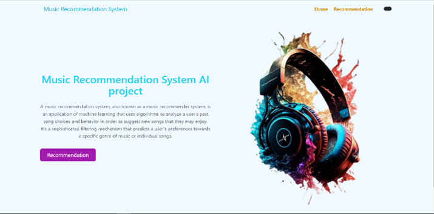

# **Music Recommendation System**

This project is a music recommendation system designed to provide users with personalized song suggestions based on a song of their choice. Using a **content-based filtering** approach, the system analyzes the intrinsic characteristics of a song to find others that are similar, offering an effective alternative to manual searching.

The project integrates data from a **Kaggle dataset** and the **Spotify Web API** to ensure broad track coverage. The user interface is built with the **Flask** framework, enabling simple and intuitive interaction.

<div align="center">
  
</div>

---

## **Features**

- **Content-Based Recommendation**: Suggests songs based on their musical attributes (e.g., tempo, energy, popularity) rather than user listening histories. This approach solves the *cold-start* problem for new users by not requiring prior listening data.

- **Spotify API Integration**: If a user requests a song not in the local dataset, the system uses the Spotify API to fetch it in real-time.

- **Intuitive Web Interface**: A user-friendly interface built with Flask and HTML allows easy interaction.

- **Redirection to Spotify**: Each recommended song includes an image that links to its Spotify page for instant playback.

---

## **How It Works: The Methodology**

The system relies on a multi-step **content-based filtering** process:

1. **User Input & Data Collection**  
   - The user inputs a song name and artist.  
   - The Spotify API retrieves metadata and audio features (tempo, popularity, energy, etc.).

2. **Data Preparation**  
   - Combines Spotify song data with a Kaggle dataset.  
   - Applies preprocessing techniques for consistency:

   - 🔹 *Normalization*: Features like tempo and popularity are scaled between 0 and 1.  
   - 🔹 *TF-IDF for Genres*: Highlights genres that are distinctive across the dataset.  
   - 🔹 *One-Hot Encoding for Year*: Treats release years as categorical variables.

3. **Similarity Calculation**  
   - Cosine similarity is used between the feature vector of the input song and all songs in the dataset.  
   - Songs are ranked based on similarity scores.

4. **Generating Recommendations**  
   - Returns the **top 10 most similar songs**, showing title, artist, and album cover.

---

## **Tech Stack**

- **Backend**: Python, Flask  
- **Data Analysis & ML**: Pandas, Scikit-learn  
- **API**: Spotipy (Spotify Web API client)  
- **Frontend**: HTML  

---

## **Setup and Launch**

Follow these steps to run the project locally:

1. **Clone the repository**
   
   ```bash
   git clone https://github.com/your-username/your-repo.git
   cd your-repo
   
2. Create a virtual environment (optional but recommended)

3. Install dependencies

   ````bash
    pip install -r requirements.txt
  
4. Configure Spotify API Credentials
Go to the Spotify Developer Dashboard

Create a new app and retrieve your Client ID and Client Secret

Open main.py and update:

```python
CLIENT_ID = "YOUR_CLIENT_ID"
CLIENT_SECRET = "YOUR_CLIENT_SECRET"
```

5. Ensure you have the dataset

Place `tracks_with_genres_v4.csv` in the root directory of the project.

6. Launch the Flask application
  ```bash
   python app.py
```

## **Demo**
📥 [Download the demo video](videos/demo.mp4)
📄 [Download the project report](report.pdf)


